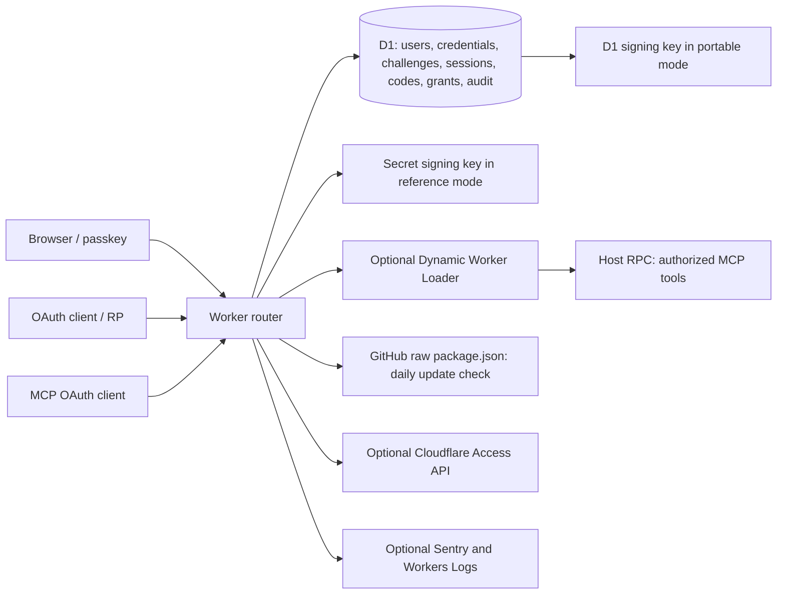

# Johnson ID security and performance review

**Scope:** clean `master` commit `89481cc3aff32dbc02628e16efb73917cc26cdcb`, 2026-10-07. This is an authorized defensive review. No application code, production data, staging data, Cloudflare settings, or deployed Worker was changed. All adversarial reproductions used temporary local D1 databases and synthetic identities. Secrets, tokens, and private keys were not printed or retained in these artifacts.

**Baseline note:** This report describes the reviewed `master` commit, before remediation. The subsequent `codex/security-review-remediation` branch changes these paths; its security scripts in this directory now assert the fixed behavior. Do not treat the findings below as claims about a later deployed version. No cloud installation or migration was validated by this local review.
`performance-portable.json` was rerun after remediation and records local post-change samples; the pre-change 223.6 ms first-use figure is preserved in this report.

## Executive summary

The most consequential confirmed issue is the portable installation's private signing key in D1: someone with **read access to D1 alone** can forge a token accepted by the public JWKS. A local end-to-end proof signed a synthetic ID token using a D1-read key and verified it against the instance's JWKS. The reference instance's secret-held key does not have that D1-read exposure. The threat model's suggestion that D1 storage barely changes risk needs revision.

Other confirmed boundaries: an unrelated OAuth client can consume a code or rotate a refresh token it possesses before the client binding is checked; a removed group member can keep refreshing a group-restricted client grant; an access token with only `offline_access` carries profile and group claims and succeeds at `/userinfo`; a failure after first-admin insertion can permanently close `/setup` without issuing an enrollment link. These were reproduced against an isolated local Worker. None requires a production attack to validate the code path.

The setup first-admin insert itself is conditional and atomic. WebAuthn verifies origin, RP ID and credential ownership, but **does not require user verification** (confirmed below). Active user and admin state is looked up again for sessions and privileged MCP calls. Local tests rejected a read-only token's write attempt and blocked outbound `fetch` in a Dynamic Worker. No remote identity takeover or sandbox escape was reproduced.

Performance evidence is local only. Warm reference requests were 1.3–5.3 ms median in small synthetic data; the portable instance's first request with RSA key generation took 223.6 ms. The local scheduled invocation including upstream check took 147.3 ms. Admin dashboard fan-out, unpaginated user listings, challenge cleanup writes, and per-execution Dynamic Worker creation are the main scaling/cost concerns. These timings do **not** estimate production latency or capacity.

## Architecture and trust boundaries

Request flows: `/setup` checks whether any user exists, compares `SETUP_TOKEN`, inserts one admin, then creates an enrollment link. `/webauthn/*` stores a short-lived D1 challenge, verifies a passkey assertion/attestation, and issues a hashed D1 session referenced by a secure `__Host-` cookie. `/authorize` resolves a registered/DCR/CIMD client, checks redirect, scopes, group/admin eligibility, session and consent, then creates a D1 code. `/token` redeems a code or rotates a D1 refresh token, signing JWTs with the configured key. `/userinfo` verifies a signed access token and reads current user claims. `/mcp` accepts OAuth/API tokens, checks scopes and current admin, and optionally runs model-written code in a Dynamic Worker via a constrained host RPC. Admin pages use current admin session. Scheduled work removes expired rows and checks upstream version.

| Integration | Data sent / authority received | Boundary |
|---|---|---|
| Relying apps / OAuth clients | Browser redirects, code, ID/access/refresh tokens, profile/group claims subject to scope behavior below | A compromised client can hold and replay its tokens; it cannot sign IdP tokens without key access. |
| Cloudflare Workers, D1, Rate Limiting | Full requests, persistent identity records, key in portable mode, per-IP counters | D1 read becomes signing authority only in portable mode. |
| Dynamic Worker Loader | Model-written source and authorized tool RPC; isolated code result | Optional; no Loader returns an explicit error. Platform isolation and host RPC remain critical. |
| Cloudflare Access API | Optional account token reads apps/policies for launcher import | Access is a discovery integration, not the app's authorization engine. |
| GitHub raw/API/pages | Configured repo name, request metadata; administrator clicks can reveal IP/browser | Version response is parsed as a version string; no code is fetched/executed. |
| Sentry / Workers Logs | Exceptions, traces, request metadata/URLs | Enrollment URL bearer tokens may be present in logs; retention/access was not inspected. |

### Attacker roles

| Role | Relevant authority and path |
|---|---|
| Anonymous visitor | `/setup` before first user, WebAuthn options, discovery/JWKS, DCR/CIMD, public auth redirects. |
| Invitee | Seven-day enrollment bearer link; can register a key for the linked identity. |
| Ordinary user | Own session/passkeys, consent and grants; seeks admin/group escalation. |
| Malicious OAuth client | Can register a public client, direct victims through authorization, submit possessed codes/tokens. |
| Compromised RP or sibling subdomain | Possesses RP tokens/codes; sibling host is same-site but same-origin guard checks browser mutations. |
| Stolen session/token holder | Acts within token authority and lifetime; a recent session can add a passkey. |
| Malicious MCP caller | Holds read/write scoped credential and may submit model code to `execute`. |
| Compromised administrator | Can create users, clients, grants, tokens and keys through intended admin powers; must be treated as root authority. |
| D1 read operator / compromised build or log reader | D1 read can forge in portable mode; log reader may see unused enrollment URLs. |

### Deployment modes

| Property | Reference `cf` instance | Portable Workers Builds installation |
|---|---|---|
| Config | `cloudflare.config.ts:26-79`; account pinned, production custom route plus workers.dev, separate staging Worker/D1/rate namespaces | `wrangler.jsonc:15-46`; account/resource ID rewritten by button, workers.dev, optional custom domain |
| Issuer / passkey RP | Explicit `https://auth.johnson.network` and explicit staging issuer | Request URL origin until `ISSUER` set; RP ID derived from it |
| Signing key | Secret `SIGNING_KEY_JWK`, optional previous key | Generated private JWK persisted in D1 `signing_keys.current`; no previous-key facility in this path |
| Loader | Bound | Omitted by default; `execute` fails closed |
| Rate limits / cron | AUTH 30/min, API 300/min; hourly at `:17` | Same limits and cron in template; rate bindings remain optional to app runtime |
| Migrations | Manual reference steps; `npm run deploy` calls `cf deploy` | `WORKERS_CI=1` runs remote D1 migrations before `wrangler deploy` |
| Preview | Production preview URLs on despite explicit issuer; staging off | Off |

Both dry-run deploy builds succeeded, each 1,709.82 KiB upload / 359.21 KiB gzip. The reference `cf` dry run also emitted a Docker socket warning while exiting 0. Workers Builds' `WORKERS_CI=1` behavior and Deploy-to-Cloudflare resource creation are documented by Cloudflare ([Build configuration](https://developers.cloudflare.com/workers/ci-cd/builds/configuration/), [Deploy buttons](https://developers.cloudflare.com/workers/platform/deploy-buttons/)), but **the actual button install was not performed**. Local template setup does not prove Cloudflare provisioning, secret prompt, migration ordering, or first deployed request. A disposable Cloudflare account/install is needed to test those without violating the no-deploy boundary. The staging endpoint was read-only checked (health, discovery issuer, JWKS); staging E2E was withheld because its harness deletes staging tables.

### Controls and behavior checked without an exploit

- **First run:** `src/setup.tsx:25-33,78-118` requires a present 12+ character token, compares SHA-256 hashes with timing-safe comparison, audits wrong guesses, and uses one conditional `INSERT ... WHERE NOT EXISTS`. This prevents two concurrent first-admin inserts even across isolates. The `done` flag is only isolate-local; a restored empty database reopens setup in a new isolate if `SETUP_TOKEN` remains. A migration failure before `users` exists returns 500 through `src/index.tsx:61-73` rather than allowing setup.
- **Browser sessions and CSRF:** `src/session.ts:35-97,107-127` uses a fresh random token hashed in D1, current-user lookup, sliding expiration, and `__Host-` Secure/HttpOnly/SameSite=Lax cookie. `src/index.tsx:34-46,75-110` checks Fetch Metadata/Origin on cookie mutations, sends no-store HTML, HSTS, frame denial and a restrictive CSP. The CSP omits `form-action` by design (`:99-102`); a sibling subdomain alone did not yield a reproduced CSRF. Browser-session revocation does not retract a relying app's own session.
- **Passkey ownership and replay:** `src/webauthn.ts:128-142,217-274,331-410` binds enrollment token to stored challenge, verifies exact origin/RP ID and credential belonging to selected user, then creates a new session. Counters are checked for nonzero-count keys. `src/webauthn-challenges.ts:48-75` intends one-use challenges but uses separate read/delete; concurrent duplicate acceptance remains unverified. `src/webauthn.ts:186-254` burns an enrollment token before credential storage, so a subsequent write failure can strand a link.
- **OIDC:** `src/oidc.tsx:89-150,164-258` exact-matches registered redirects except RFC 8252 loopback port, requires PKCE S256 for public clients, binds state/nonce/code challenge/resource to the request, enforces `max_age` and `prompt=login/none/consent`, and shows consent for third-party clients. `src/oauth-token.ts:28-58,86-110,116-215,234-280` authenticates confidential clients, atomically consumes codes/refresh tokens, narrows refresh scope, and revokes refresh families. Remaining exceptions are C2/C3/C5. JWT access tokens are stateless for up to one hour (`src/oauth-token.ts:234-235`); disabling a user immediately blocks UserInfo and fresh tokens but cannot retract a copied token at an unrelated RP. [OIDC Core](https://openid.net/specs/openid-connect-core-1_0.html) requires `openid` to invoke OIDC semantics and describes `profile`/`email` claims as scope requested.
- **MCP/admin:** `src/admin/index.ts:19-33` gates every admin subroute on a current admin session; shared operations use the caller actor. `src/mcp.ts:37-74,164-190` checks API-token expiry and creator's current admin role, or JWT audience `${ISSUER}/mcp`, scope and current admin. `src/mcp/sandbox.ts:39-52,197-246` passes a host-created RPC stub, rechecks current admin and read-only permission for every tool, denies outbound network, and returns a clear error when Loader is missing. Local E2E blocked read-only `users_create` and sandbox `fetch`. Isolation escape, side-channel leakage, and platform quotas were not tested.
- **Upstream/Access:** `src/upstream.ts:21-86` accepts an owner/repo or `off`, stores a parsed numeric version after a scheduled GitHub raw fetch, and does not execute fetched content; rendered version text is escaped. The update notice and feedback links can lead an admin/AI client to external GitHub pages (`src/admin/settings.tsx:25-65`), so repo choice is an administrator trust decision. Optional Cloudflare Access API reads app/policy metadata for launcher import (`src/cf-access.ts:19-37,119-169`); importing a launcher tile does not itself enforce Access policy.

## Confirmed vulnerabilities and failures, ordered by severity

Each reproduction script is safe for an isolated local environment and prints only status/metadata.

### C1 — D1 read access is token-signing authority in portable mode — **Critical**, high confidence

- **Asset / prerequisites:** Identity signing authority; attacker or operator able to read portable instance D1 `signing_keys`, without Worker secret access.
- **Trace:** `src/instance.ts:23-60` generates and persists the private JWK, reads it on every new isolate, and supplies it as `SIGNING_KEY_JWK`; `src/crypto.ts:64-80,99-123` publishes the public key and signs JWTs. `migrations/0008_signing_keys.sql:3-8` creates the row.
- **Evidence:** `node review-artifacts/d1-read-forgery.mjs` read only local D1, signed a synthetic arbitrary-subject/audience ID token in memory, and validated it against that Worker's `/jwks` (`PASS`). No key or token was printed.
- **Impact / controls:** Forged identities can be accepted by relying apps that validate that JWKS; reference mode's secret takes precedence and avoids this *D1-read-only* path. Full Worker compromise remains catastrophic in both modes.
- **Minimal fix / regression:** Require a secret-held signing key for real installations, or use a non-exportable managed signing service with explicit key lifecycle. Do not silently generate an exportable private key into D1. For existing portable users, plan key migration with old JWKS continuity and RP validation. Regression: an operator with D1 read must not obtain signing material; verify both old/new token acceptance during rotation and intended expiry afterward.

### C2 — Removed group members can refresh a restricted client's grant — **High**, high confidence

- **Asset / prerequisites:** Client group gate; ordinary user with a valid refresh token issued while in a permitted group, later removed from it.
- **Trace:** `src/oidc.tsx:164-180` checks `allowed_groups` at authorization; `src/oauth-token.ts:165-215` rotates and mints again without applying that check. Current admin status is checked only for admin scopes at `:202-206`.
- **Evidence:** `node review-artifacts/token-boundaries.mjs` removed synthetic user's `family` membership, then refreshed the family-only client's grant: HTTP 200 and a new ID token.
- **Impact / controls:** Access can persist for the refresh family's 30-day lifetime if an RP relies on the IdP group gate rather than checking current `groups` claim. Disabled users fail `claimsFor`; dynamic client grants are checked for revocation.
- **Minimal fix / regression:** Re-evaluate client group policy before any new token, including refresh; revoke/deny family on loss. E2E: authorize in group, remove membership, confirm refresh denied and existing access-token expiry behavior documented.

### C3 — Access tokens and `/userinfo` expose claims beyond granted identity scopes — **Medium**, high confidence

- **Asset / prerequisites:** User profile and group claims; holder of a valid access token with no `openid`, `email`, or `profile` scope.
- **Trace:** `src/crypto.ts:133-155` embeds email, name, and groups in every signed access token regardless of `scope`. `src/oauth-token.ts:256-280` verifies signature/type/issuer then returns the same claims regardless of granted scope or audience.
- **Evidence:** `node review-artifacts/token-boundaries.mjs` used a synthetic access token with only `offline_access`; `/userinfo` returned HTTP 200 and synthetic email.
- **Impact / controls:** A token recipient can decode profile/group claims without calling UserInfo; UserInfo repeats them for a valid token even if no identity scope was granted. [OIDC Core §5.4](https://openid.net/specs/openid-connect-core-1_0.html#ScopeClaims) ties profile and email claims to requested scopes. A disabled user is rejected by UserInfo's fresh DB lookup, but existing JWT claims remain until expiry.
- **Minimal fix / regression:** Put only claims justified by scopes into access tokens, require `openid` for UserInfo, and return fields according to granted scopes; verify intended audience/resource policy. E2E: decode no-identity-scope token and check it has no profile/group fields; UserInfo denies it; identity scope combinations reveal only intended fields.

### C4 — Passkey ceremonies do not require user verification — **Medium**, high confidence

- **Asset / prerequisites:** Passkey identity; possession/control of a registered authenticator that does not perform UV, or ability to register one through a legitimate enrollment link or recent session. A remotely phished password is not sufficient.
- **Trace:** `src/webauthn.ts:100-115,291-300` requests `userVerification: "preferred"`; verification explicitly sets `requireUserVerification: false` at `:231-237,358-370`. The threat note at `:34-37` acknowledges this as a compatibility choice.
- **Evidence:** `node review-artifacts/no-user-verification.mjs` used isolated Chromium with a virtual USB authenticator declaring `hasUserVerification: false`; enrollment and later sign-in both succeeded (`PASS`).
- **Impact / controls:** A found/stolen compatible key can authenticate with a touch alone; no local PIN/biometric is enforced by the server. Origin/RP ID and signature checks preserve phishing resistance, and an attacker still needs the key or enrollment authority. This is a security policy gap for a root-of-trust IdP, not proof of remote bypass.
- **Minimal fix / regression:** Decide whether all accounts require UV. For root-of-trust use, request and require UV on registration and authentication; existing credential rows do not record prior UV, so plan a re-enrollment or transition policy. E2E: virtual no-UV authenticator is rejected, UV authenticator remains usable.

### C5 — A wrong client consumes a valid code or rotates a refresh token — **Medium**, high confidence

- **Asset / prerequisites:** Grant availability; attacker must possess another client's code or refresh token and have a registered client. No signing/identity escalation was observed.
- **Trace:** `src/oauth-token.ts:120-153` marks code used before `row.client_id !== client.id` and redirect/PKCE checks. `src/oauth-token.ts:169-187` rotates refresh token before client check; later legitimate use triggers family deletion at `:175-184`.
- **Evidence:** `node review-artifacts/token-boundaries.mjs`: wrong-client redemption returned 400 but left code `used=1`; wrong-client refresh returned 400 but set `rotated_at`, then legitimate reuse returned 400 and deleted family.
- **Impact / controls:** Targeted denial and false reuse audit, particularly for intercepted codes/refresh tokens. Atomic single-use update blocks double redemption and PKCE blocks minting by wrong party. [OAuth Security BCP](https://www.rfc-editor.org/rfc/rfc9700.html) requires refresh tokens bound to the client.
- **Minimal fix / regression:** Include `client_id` and other immutable grant predicates in atomic `UPDATE ... WHERE ... RETURNING`; do not modify on wrong client. Reuse detection must distinguish wrong client from real replay. E2E: wrong-client attempt leaves code/refresh family redeemable by correct client.

### C6 — Partial first-run setup can permanently strand the first admin — **Medium**, high confidence

- **Asset / prerequisites:** Initial availability; an operational DB/audit failure after successful insert, no attacker needed.
- **Trace:** `src/setup.tsx:103-117` conditionally inserts admin, sets isolate `done`, then independently audits and mints enrollment link. `setupPending` at `:25-33` permanently closes when any user exists.
- **Evidence:** `node review-artifacts/first-run-failure.mjs` intentionally removed local `audit_log` after migrations. Correct setup POST returned 500, D1 had one admin and zero enrollment tokens, and GET `/setup` returned 404.
- **Impact / controls:** Fresh install can be locked out until manual repair. Conditional insert protects against concurrent double first-admin claims; token hash comparison and same-origin guard exist. A missing migration normally fails closed earlier, but failures after insert remain possible.
- **Minimal fix / regression:** Make first-admin and enrollment-token creation atomic in one D1 batch/transactional design, then perform noncritical audit afterward; document idempotent recovery that never reopens ownership to unknown parties. E2E: inject post-insert failure, retry safely, and ensure exactly one admin with a usable enrollment path.

## Unverified risks

The cited code observations are high confidence; exploitability or operational impact in a real installation is unverified where no safe local proof is listed. Each row states the needed attacker or operational condition and the validation that would resolve it.

| Priority | Evidence / prerequisite / possible impact | Minimal validation or fix |
|---|---|---|
| High: enrollment bearer URL in logs | `src/ops.ts:21-28` puts a seven-day bearer in `/enroll/{token}` and `src/index.tsx:167-179` handles GET. [Workers Logs include request URL metadata](https://developers.cloudflare.com/workers/observability/logs/workers-logs/). A log reader could enroll their own passkey while link unused. Hash-at-rest, one-use, and `Referrer-Policy: no-referrer` mitigate other exposures. Live log retention/access was **not inspected**; this remains an unverified deployment risk. | Inspect redacted log schema/access in disposable install. Use fragment-delivered token plus same-origin POST or equivalent non-URL bearer transport; redact old paths and shorten expiry. E2E: captured request metadata contains no bearer. |
| High: request-origin issuer drift | `src/instance.ts:55-60`, `src/config.ts:53-65`, `wrangler.jsonc:7-9,19-25`: portable instance serves any routed hostname using that URL origin; discovery, JWT `iss`, passkey RP ID and redirects can differ by workers.dev/custom domain. Cloudflare routing/host spoofing was **not** tested. Explicit `ISSUER` may make alias pages advertise canonical issuer, but WebAuthn on alias host cannot complete for canonical RP ID. | Install in disposable account, test workers.dev/custom domain/route/preview and DNS transition with browser passkey plus OIDC RP. Pin canonical issuer before enrollment, redirect aliases at edge, validate host and plan issuer migration. |
| High: D1 key cache/rotation and restore | `src/instance.ts:23-51` caches key forever per isolate; local D1 replacement left `/jwks` advertising old key. No portable previous-key path. Lost D1 key changes issuer's signing identity; restored DB can revive an old key. | Add explicit key ID/version, lifecycle, backup and multiple JWKS keys; test concurrent isolates and restore/rotation. Do not overwrite key in live D1 until token transition is planned. |
| Medium: setup token quality/rate availability | `src/setup.tsx:23,78-118` enforces length 12, not entropy; `src/index.tsx:53-86` limiter is optional and per-IP on POST. `SETUP_TOKEN` selection/prompt in actual button and WAF policy not verified. A weak installed secret allows first-admin claim; a restored empty DB with retained token reopens setup on a new isolate. | Generate high-entropy token by installer, require strong secret, fail closed without limiter or edge rule; test failed guesses and restore in disposable environment. Clear setup secret after ownership established with documented recovery. |
| Medium: CIMD unbounded body and anonymous latency | `src/oauth-clients.ts:150-169` checks `Content-Length` then buffers entire body before enforcing 5 KiB; absent/false length can consume memory. `src/index.tsx:83-86` limits mutations only; anonymous GET `/authorize` can trigger up to 5 s remote fetch. DNS resolution/private-address rebinding was not reproduced; literal IP and redirects are blocked (`src/oauth-clients.ts:121-126,160-164`). | Stream with strict byte cap, bind/validate resolved addresses if platform permits, and apply per-source/global fetch budget; run local malicious metadata server E2E and controlled cloud DNS test. |
| Medium: challenge read/delete race | `src/webauthn-challenges.ts:48-75` reads then deletes in separate statements. Concurrent requests may both obtain the same challenge; successful identity forgery was **not** reproduced and signed assertion/counter checks still apply. | Atomic `DELETE ... RETURNING`; race two valid responses in isolated test, expect one acceptance. |
| Medium: recent-session passkey addition | `src/webauthn.ts:79-125,207-274` accepts a session authenticated within 15 minutes for passkey addition; a stolen fresh session can add an attacker's key. `docs/THREAT_MODEL.md:106-108` overstates this boundary. | Require a fresh WebAuthn assertion bound to the add-key action or equivalent step-up; test stolen-session scenario. |
| Medium: Dynamic Worker cost/resource limits | `src/mcp/sandbox.ts:197-246` loads code per `execute` without stable ID, 20 s CPU, 500 subrequests, 25 s Promise race (does not cancel worker), and unbounded captured logs/tool calls/output. Local read-only write and outbound fetch were blocked; no sandbox escape was shown. [Dynamic Workers pricing](https://developers.cloudflare.com/dynamic-workers/pricing/) charges unique loaded workers and requires Paid plan. | Set explicit per-request quotas and bounded output/logs, enforce cancellation/cleanup; measure sandbox cold start and billed worker count on a disposable paid staging account. |
| Medium: upstream fetch response and outage | `src/upstream.ts:60-80` defaults to redirect-follow and unbounded `r.json()` with 5 s timeout; version is numeric parsed and escaped on render, so no HTML injection observed. Failed check is stamped for one day; stale notice can persist. | Manual redirect deny, bounded stream, record failure/last-success separately; E2E oversized/redirect/outage fixtures. |
| Medium: DCR / custom scheme review | `src/oauth-clients.ts:58-98` permits arbitrary private-use schemes except a blocklist and loopback port variance; exact registered redirect check exists. `src/oauth-clients.ts:246-300` registration is public with optional limiter. No malicious native-handler takeover reproduced. | Pin client policy and require operator approval for sensitive scopes/client IDs; verify RFC 8252 native-app scheme ownership and DCR quotas in disposable install. |

## Hardening opportunities

These are code/config observations with high confidence; practical exploit or outage risk depends on deployment and load.

| Priority | Evidence / prerequisite / possible impact | Minimal validation or fix |
|---|---|---|
| Medium: build/dev dependency advisory | `npm audit --omit=dev` reports high `sharp@0.35.4` (via installed `miniflare@5.20261006.0-alpha`/`wrangler@4.148.0`) for [GHSA-wq5f-xc86-pv6w](https://github.com/advisories/GHSA-wq5f-xc86-pv6w), fixed in 0.35.5. No runtime SVG-processing exploit path was found in the Worker. | Upgrade compatible build chain and rerun audit/build; treat CI image/content trust separately. |
| Low: operational secret/rollback assumptions | Portable migrations happen before deploy (`scripts/deploy.mjs:15-20`), so Worker rollback alone cannot roll back a schema change. Reference migrations are manual. Both modes have hourly cleanup. D1 errors prevent even `/healthz` in portable mode because global key resolution runs first (`src/index.tsx:61-73`). | Add additive-only migration gate, schema backup and restore rehearsal, independent liveness/readiness, and a tested key/data rollback runbook. |

## Documentation and safety drift

- `docs/THREAT_MODEL.md:139-152` describes D1 private-key storage as barely changing the risk. C1 demonstrates a meaningful privilege expansion from D1 read to token signing.
- `docs/THREAT_MODEL.md:106-108` says stolen session alone cannot add a passkey; a session within the 15-minute recent-auth window can.
- `scripts/setup.sh` still expects `wrangler.toml`, which this repository does not contain; it is stale relative to both deploy modes.
- `e2e.config.ts:9-18` defaults `npm run test:e2e` to production, and `tests/ceremony/passkey.e2e.ts:32-46` inserts/deletes live D1 rows. Do not use this target for routine review. The local suites are safe alternatives. `tests/e2e/remote-instance.mjs:23-26` clears staging tables, so the staging suite requires an explicitly disposable staging database.
- The threat model and deployment docs should state issuer immutability, D1 key restore consequences, log exposure of enrollment paths, and migration-before-deploy rollback limits.

## Coverage matrix

`T` = isolated local E2E/reproduction, `I` = code/config inspection, `R` = read-only remote check, `—` = not covered.

| Boundary | Reference | Portable | Notes |
|---|---|---|---|
| Setup ownership, atomic first admin, failure | T/I | T/I | Actual button secret prompt and cloud races —. |
| Issuer, aliases, RP ID | I/R staging issuer | T/I | Real custom-domain transition —. |
| Signing key, D1-read forgery, cache | T/I secret precedence | T/I | Multi-isolate/backup/rotation in cloud —. |
| WebAuthn enrollment/auth and sessions | T/I Chromium, including no-UV proof | T/I template suite | Concurrent challenge replay —. |
| OAuth codes, refresh, userinfo, group changes | T/I | Shared code I | Wrong-client and scope proofs T. |
| CIMD/DCR, redirects, consent | T/I existing suite | Shared code I | DNS rebinding/oversize stream cloud —. |
| Admin UI, MCP scope, execute sandbox | T/I | I, missing Loader fails closed | Platform escape and quotas —. |
| Upstream update/check/feedback | T/I local scheduled | Shared code I | Real remote response/outage behavior —. |
| Builds, migrations, rollback, supply chain | Dry-run/I | Dry-run/I | Actual one-click install —. |
| Staging/prod | R health/discovery/JWKS only | — | No mutation or load tests. |

## Repeatable performance baseline and optimization order

All values are **local**, one host, tiny synthetic D1, sequential traffic; browser WebAuthn timings include local browser transport. No cloud p95, cold-isolate frequency, production row count, D1 billing telemetry, or staging load timing was collected. Re-run scripts below for the same measurement method.

| Request | Reference warm median (5 samples) | Additional evidence |
|---|---:|---|
| `/healthz`, `/jwks`, `/login`, closed `/setup` | 2.1, 1.3, 1.4, 1.7 ms | Portable first `/healthz` including RSA key generation 223.6 ms; warm health 1.4–2.8 ms, pending setup 1.6–5 ms. |
| WebAuthn auth/register options | 3.3 / 3.6 ms | Chromium ceremony: register options 8.1 ms, verify 8.3 ms; auth options 4.8 ms, verify 7.1 ms (single samples). |
| `/authorize`, successful `/token`, `/userinfo` | 3.4, 4.1, 1.8 ms | Token path includes D1 updates/signing; no production latency inference. |
| Admin dashboard, audit, account | 5.3, 2.9, 3.2 ms | Dashboard has ~12 D1 statements in one Promise.all (`src/admin/dashboard.tsx:135-179`), several aggregations/scans. |
| MCP tools/list | 2.6 ms | `execute` local samples 25, 10.4, 8.3 ms; platform/billing performance not measured. |
| Scheduled cleanup + update check | — | One local invocation 147.3 ms / HTTP 200; includes external GitHub request and D1 cleanup. |

The main Worker upload was 1.71 MB raw / 359 KB gzip; browser app JS was about 39.7 KB and CSS about 44.9 KB. No real cold-start distribution was measured.

Code-counted D1 work explains the local baseline: a normal reference request avoids the portable key lookup, while each new portable isolate reads `signing_keys` once (`src/instance.ts:38-51`); first use also generates RSA and attempts an insert/read. Every passkey options call writes a cleanup DELETE and challenge INSERT (`src/webauthn-challenges.ts:27-45`), in addition to user/credential reads. The admin dashboard itself issues **12 D1 statements** concurrently (`src/admin/dashboard.tsx:135-173`), plus middleware/session and UI setting queries. This is a source-level count, not a billed-rows measurement. `migrations/0001_init.sql`, `0006_mcp_metrics.sql`, and `0007_oauth_apps.sql` provide primary keys and several expiry/audit indexes, while `enrollment_tokens.expires_at`, `refresh_tokens.rotated_at`, and some dashboard filter/group paths lack tailored indexes. Representative-size query plans and Cloudflare rows-read metrics remain to be collected.

1. **First:** fix signing-key generation on the request path and bound update/CIMD fetch bodies. Reference mode already avoids first-use keygen; portable mode needs secure provisioning. Watch first-request latency, D1 key reads and errors.
2. **Next:** paginate admin/MCP user lists, replace `members.filter` per user (`src/mcp/tools-people.ts:14-32`) with a map, and add/confirm indexes for dashboard/audit predicates and cleanup. `src/admin/audit.tsx:124-157` uses search patterns that scan. Use `EXPLAIN QUERY PLAN` and D1 query metrics against representative synthetic sizes before index changes.
3. **Next:** move opportunistic challenge cleanup (`src/webauthn-challenges.ts:27-45`) to scheduled cleanup or throttle it; each options call currently writes a DELETE plus INSERT. Review hourly cleanup (`src/maintenance.ts:13-42`) and missing expiry indexes. Track rows read/written and query counts.
4. **Later:** cap Dynamic Worker output/tool calls and reuse stable code ID only if it preserves isolation. [Dynamic Workers pricing](https://developers.cloudflare.com/dynamic-workers/pricing/) says no ID counts each `.load()` as a unique worker; the included 1,000 per month and extra daily charge can matter even for a small admin group. Measure on disposable paid staging first.

[D1 pricing](https://developers.cloudflare.com/d1/platform/pricing/) and [limits](https://developers.cloudflare.com/d1/platform/limits/) make full scans and write amplification material; the Free tier has 5M rows read/day and 100k written/day, with hard enforcement noted in the [September 2026 changelog](https://developers.cloudflare.com/changelog/post/2026-09-01-d1-free-tier-limit-enforcement/). The Worker and Dynamic Worker limits/prices depend on the account plan ([Workers pricing](https://developers.cloudflare.com/workers/platform/pricing/)). No bill estimate is justified without production volume/plan telemetry.

## Remediation and validation / rollback

| When | Work | Validation | Undo / recovery |
|---|---|---|---|
| Immediate | Protect portable signing authority; constrain D1 key readers and logs; do not replace live key until all RPs/JWKS caches and prior tokens are accounted for. Fix `/userinfo` scope and refresh group gate. | Isolated E2E above, then disposable install with two RPs and key transition. Confirm forged-D1-read proof no longer works. | Preserve old public key/JWKS during token lifetime; retain encrypted backup and a documented restore. Revert Worker code only if old schema/key remains compatible. |
| Next | Bind code/refresh updates to client, make setup link issuance atomic/recoverable, remove enrollment bearer from URL logs, require strong setup token, decide and enforce UV policy. | Wrong-client token remains valid for owner; injected setup failure recovers exactly one admin; browser enrollment and captured logs pass; no-UV browser proof fails when UV is required. | Additive D1 migration; snapshot D1 before applying, restore in isolated rehearsal; never reopen `/setup` broadly as ad hoc fix. Plan key re-enrollment before rejecting existing no-UV credentials. |
| Later | Pin portable issuer before user enrollment, cap remote fetches and sandbox outputs, tune indexes/pagination, update docs/test defaults and dependency chain. | Disposable one-click install, alias/domain browser passkeys, bounded hostile metadata and update responses, representative-size query plans and quotas. | Keep old issuer route during planned migration or require passkey re-enrollment; roll back code and schema/data together according to rehearsal. |

## Commands, artifacts, assumptions, and blocked checks

Successful local checks: `npm run typecheck`; `npm run test:e2e:local`; `npm run test:e2e:setup`; `npm run deploy:check`; `npx wrangler deploy --dry-run --outdir /tmp/edge-idp-portable-dryrun`. Reproductions: `node review-artifacts/token-boundaries.mjs`; `node review-artifacts/d1-read-forgery.mjs`; `node review-artifacts/first-run-failure.mjs`; `node review-artifacts/no-user-verification.mjs`. Measurements: `node review-artifacts/performance-local.mjs`; `node review-artifacts/performance-portable.mjs`; `node review-artifacts/performance-ceremony.mjs`. JSON baselines of the same names are checked in this review artifact directory. Scripts create isolated temporary D1 state and use synthetic accounts; they require local dependencies and Chromium for ceremony.

`npm audit --omit=dev --json` returned exit 1 with the `sharp` advisory described above. Read-only staging health/discovery/JWKS responded 200 with expected explicit issuer and one public key. The available Cloudflare MCP connector was tied to a different account and rejected personal-account access; the authenticated `cf` CLI and local dry-run remained available. No Daybreak or Codex Security review capability was exposed in this session. Production was not touched. Staging E2E was not run because its harness clears data. A real Deploy-to-Cloudflare button install, platform log review, multi-isolate key races, custom-domain transitions, cloud Dynamic Worker limits, Cloudflare Access integration, and staging performance require a dedicated disposable environment/account, relevant plan, and permission to deploy or inspect its telemetry. They remain unverified.

Source files and docs reviewed: `README.md`, `DEPLOY.md`, `CONTRIBUTING.md`, `docs/THREAT_MODEL.md`, both configs, all migrations, deployment/setup/build scripts, request handlers, DB/auth/crypto/MCP/admin/Access/upstream modules, local/setup/remote E2E harnesses and browser ceremony tests. Documentation was treated as claims and compared with implementation.
